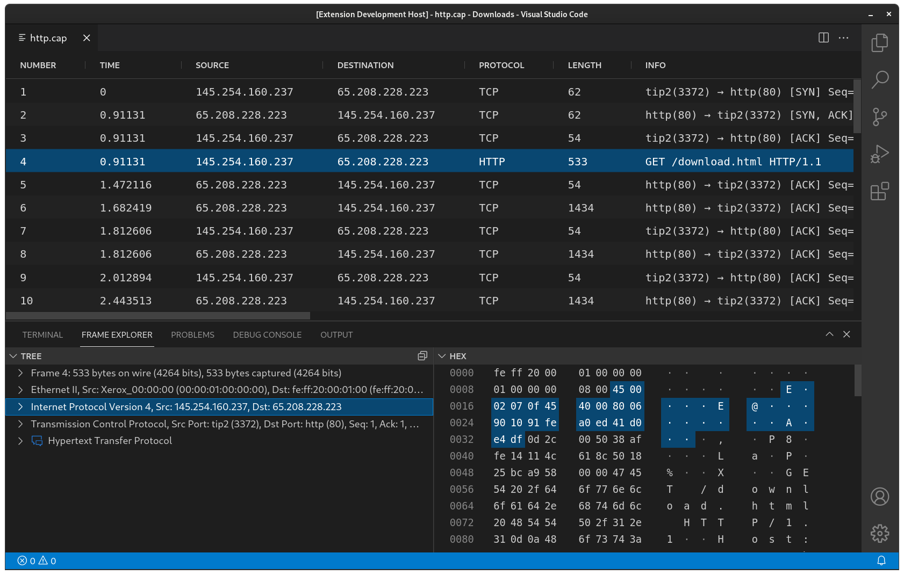

# About Crumbs

Crumbs is an extension for vscode that allows you to inspect packet traces without ever leaving your editor. The goal for Crumbs is to be able to open pcaps with Wiresharks dissection from within vscode and to prevent you from ending up with dozen of Wireshark windows and wasting time trying to find the correct one. Live capturing and any kind of editing pcaps is out of scope (at least for now).

<br/>

<p align="center">
  
</p>

<br/>

## Getting Started
To provide Wiresharks dissection and amazing file compatibility, sharkd has to be installed.

```bash
 # Fedora
 sudo dnf install wireshark-cli

 # Ubuntu
 sudo apt install wireshark-common
```
After that you should be good to go!<br/>
If not, please make sure that the correct path is used in the extensions sharkd setting.

### Opening Trace Files
Crumbs is already set as the default editor for a lot of file extensions. If your tracefile does not open the Frame List by default please check if the correct editor is selected and if your file type is actually [supported by Wireshark](https://gitlab.com/wireshark/wireshark/-/wikis/FileFormatReference).

### Windows
Currently there is no way to run this extension directly under Windows. But it is possible to use Crumbs via WSL!

#

<a href="https://www.buymeacoffee.com/lukaschneider" target="_blank"></a>
